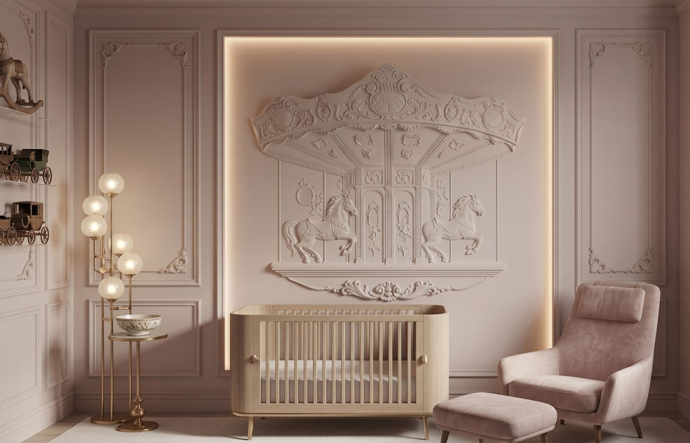
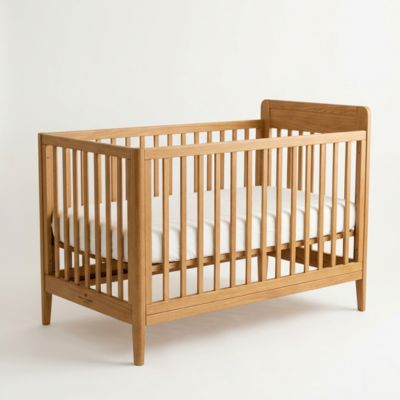

# Velvet & Cradle — Code & Content Rules

Bu dosya, Velvet & Cradle website'inin kodlama kurallarını ve içerik standartlarını içerir.

---

## 📁 DOSYA YAPISI VE İSİMLENDİRME

### Genel Kurallar
- **Dosya adları:** Küçük harf, boşluk yok, Türkçe karakter yok
- **Ayırıcı:** Tire (-) kullan, alt çizgi (_) kullanma
- **Extension:** `.html` için küçük harf

### Örnekler
```
✅ DOĞRU:
- blog-modern-minimalist.html
- about.html
- product-organic-sheet.jpg

❌ YANLIŞ:
- Blog Modern Minimalist.html
- blog_modern_minimalist.html
- About.HTML
- product-organik-çarşaf.jpg
```

### Klasör Yapısı
```
velvetandcradle/
├── index.html
├── about.html
├── contact.html
├── blog.html
├── editorial.html
├── style.css
├── main.js
├── images/
│   ├── hero.jpg
│   ├── blog-minimalist.jpg
│   └── product-crib.jpg
└── docs/
    ├── rules.md
    └── velvetandcradle-kilavuz.html
```

---

## 🖼️ GÖRSEL KURALLAR

### Dosya Formatı
- **Zorunlu format:** JPEG (.jpg)
- **Kalite:** %85
- **Color profile:** sRGB
- **Compression:** Progressive JPEG

### Boyut Standartları
| Alan | Boyut | Dosya Boyutu |
|------|-------|--------------|
| Hero (Ana sayfa) | 1400×900px | 300-400KB |
| Blog kartları | 800×500px | 150-250KB |
| Ürün fotoğrafları | 800×800px | 100-150KB |
| Blog hero | 1200×800px | 200-300KB |
| İkonlar (yuvarlak) | 160×160px | 20-30KB |

### Optimizasyon Araçları
- **Önerilen:** [squoosh.app](https://squoosh.app)
- **Ayarlar:** JPEG, %85 kalite, progressive
- **Hedef:** Tablodaki dosya boyutları

---

## 🔗 HTML KURALLAR

### Link Yapısı
```html
<!-- Blog sayfaları için -->
<a href="blog-modern-minimalist.html">Modern Minimalist</a>

<!-- Ürün linkleri (geçici) -->
<a href="coming-soon-products.html" class="btn-primary small">View Product</a>

<!-- External linkler -->
<a href="https://example.com" target="_blank" rel="noopener">External Link</a>
```

### Image Yapısı
```html
<!-- Standart resim -->


<!-- Product card resmi -->


<!-- Placeholder (geliştirme için) -->
<div class="img-placeholder large">
  <span>Hero Image 1400 × 900px</span>
</div>
```

### Meta Tags
```html
<!-- Her sayfada zorunlu -->
<title>Sayfa Başlığı — Velvet & Cradle</title>
<meta name="description" content="Sayfa açıklaması max 160 karakter">
```

### Google Analytics (Zorunlu)
**ÖNEMLI:** Her yeni HTML sayfasında `<head>` bölümünün en üstüne Google Analytics kodu eklenmelidir.

```html
<!-- Google tag (gtag.js) - HER SAYFADA ZORUNLU -->
<script async src="https://www.googletagmanager.com/gtag/js?id=G-PJD97ZT2ZK"></script>
<script>
  window.dataLayer = window.dataLayer || [];
  function gtag(){dataLayer.push(arguments);}
  gtag('js', new Date());

  gtag('config', 'G-PJD97ZT2ZK');
</script>
```

**Hangi sayfalarda gerekli:**
- ✅ Tüm public HTML sayfalar (index, blog, about, contact vs.)
- ✅ Blog post sayfaları (blog-*.html)
- ✅ Editorial sayfalar
- ❌ Kılavuz sayfası (velvetandcradle-kilavuz.html)
- ❌ Test sayfaları

### Yeni Sayfa Template
```html
<!DOCTYPE html>
<html lang="en">
<head>
  <!-- Google tag (gtag.js) - HER SAYFADA ZORUNLU -->
  <script async src="https://www.googletagmanager.com/gtag/js?id=G-PJD97ZT2ZK"></script>
  <script>
    window.dataLayer = window.dataLayer || [];
    function gtag(){dataLayer.push(arguments);}
    gtag('js', new Date());

    gtag('config', 'G-PJD97ZT2ZK');
  </script>
  <meta charset="UTF-8">
  <meta name="viewport" content="width=device-width, initial-scale=1.0">
  <title>Sayfa Başlığı — Velvet & Cradle</title>
  <meta name="description" content="Sayfa açıklaması max 160 karakter">
  <link rel="preconnect" href="https://fonts.googleapis.com">
  <link rel="preconnect" href="https://fonts.gstatic.com" crossorigin>
  <link href="https://fonts.googleapis.com/css2?family=Noto+Serif:ital,wght@0,300;0,400;1,300;1,400&family=Manrope:wght@300;400;500&display=swap" rel="stylesheet">
  <link rel="stylesheet" href="style.css">
</head>
<body>
  <!-- İçerik buraya -->
  <script src="main.js"></script>
</body>
</html>
```

---

## 📝 İÇERİK KURALLARI

### Yazı Stili
- **Ton:** Lüks, minimal, sakin
- **Dil:** İngilizce (public), Türkçe (kılavuz)
- **Başlıklar:** Title case, kısa ve net
- **Paragraflar:** Kısa cümleler, okuma kolaylığı

### Blog Post Yapısı
```
1. Hero section (başlık + açıklama)
2. Opening section (giriş)
3. Main content (2-3 bölüm)
4. Shop the Look (4 ürün)
5. Editorial Quote
6. Join the Sanctuary
7. Footer
```

### Ürün Açıklamaları
```html
<h3 class="product-name">Ürün Adı</h3>
<p class="product-desc body-sm">Kısa açıklama, max 50 karakter</p>
```

---

## 🎨 CSS KURALLARI

### Class İsimlendirme
- **BEM metodolojisi** kullan
- **Prefix:** Component bazlı
- **Camel case:** Kullanma, tire kullan

```css
/* ✅ DOĞRU */
.hero-content
.editorial-card
.product-grid
.btn-primary

/* ❌ YANLIŞ */
.heroContent
.Editorial_Card
.productgrid
```

### Responsive Breakpoints
```css
/* Desktop first yaklaşım */
@media (max-width: 900px) { /* Tablet */ }
@media (max-width: 600px) { /* Mobile */ }
```

### Color Variables
```css
:root {
  --surface: #faf9f6;
  --primary: #6c5b4d;
  --on-surface: #2f3430;
  --font-serif: 'Noto Serif', Georgia, serif;
  --font-sans: 'Manrope', system-ui, sans-serif;
}
```

---

## 🔧 DEPLOYMENT KURALLARI

### Ionos Yükleme
```
1. Sadece değiştirilen dosyaları yükle
2. images/ klasörünü komple yükleme
3. Cache temizleme için hard refresh
4. Test: velvetandcradle.com
```

### File Manager Yapısı
```
public_html/
├── index.html
├── *.html (tüm sayfalar)
├── style.css
├── main.js
└── images/ (tüm görseller)
```

### Git Workflow (varsa)
```bash
# Değişiklikleri kontrol et
git status
git diff

# Commit
git add .
git commit -m "Add new blog post about statement walls"

# Push (sadece talep edilirse)
git push origin main
```

---

## ❌ YASAKLAR

### Kodlama
- Inline CSS (style="") kullanma (grid hariç)
- !important kullanma
- Türkçe karakter dosya adlarında
- Büyük harf HTML dosyalarında

### İçerik
- Copyright ihlali
- Stock photo watermarkları
- Çok büyük dosyalar (>500KB)
- PNG format (performans)

### SEO
- Duplicate title tagları
- Missing alt attributes
- Broken internal links
- Empty meta descriptions

---

## 🔍 QA CHECKLIST

### Her Yeni Sayfa İçin
- [ ] Dosya adı doğru formatta (küçük harf, tire ile)
- [ ] **Google Analytics eklendi** (`<head>` bölümünün en üstüne)
- [ ] Title ve meta description eklendi
- [ ] All images optimized (JPEG, %85 kalite)
- [ ] Alt attributes complete (tüm img tagları)
- [ ] Internal links working (broken link yok)
- [ ] External links `target="_blank"` ile
- [ ] Mobile responsive test
- [ ] Loading speed check
- [ ] Typography consistent

### Deployment Öncesi
- [ ] Tüm linkler test edildi
- [ ] Images klasörü güncellendi
- [ ] Browser cache temizlendi
- [ ] Cross-browser test yapıldı
- [ ] Mobile test yapıldı

---

**Son güncelleme:** Nisan 2025
**Proje:** velvetandcradle.com
**Maintainer:** Claude AI Assistant